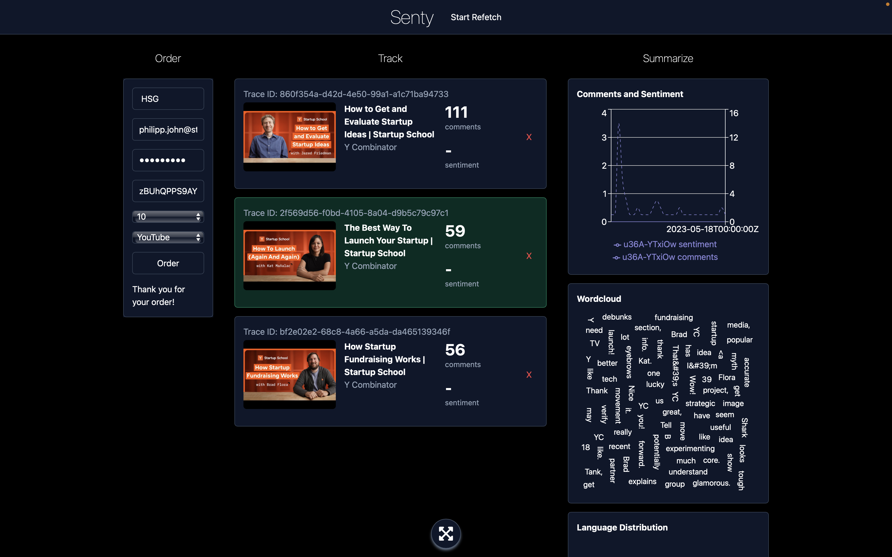
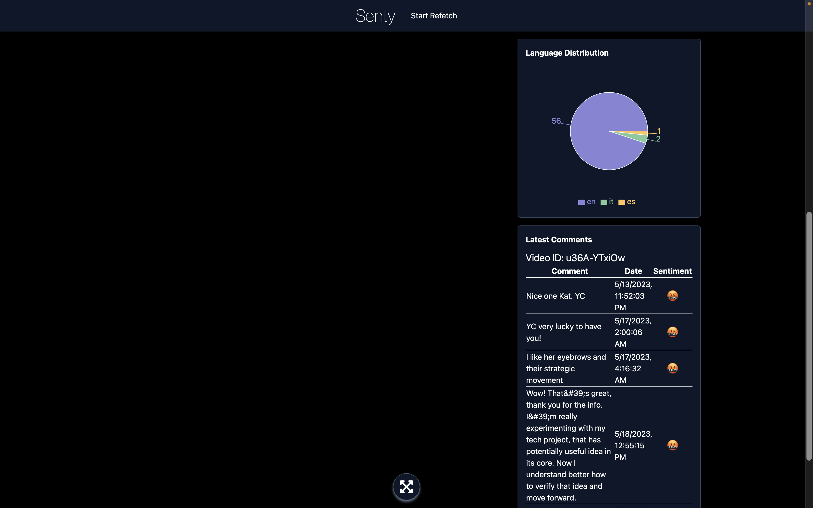

# Senty: Real-time Social Media Market Intelligence


<br />

Welcome to _Senty_, a real-time social media market intelligence platform designed and developed as part of the _Event-driven and Process-oriented Architectures (SS23)_ course at the University of St. Gallen. The brainchild of Johannes Wenz, Luka Bekavac, and Philipp John, Senty allows companies and creators to analyze comment responses from their YouTube videos at scale.

<br /><hr /><br />

## Table of Contents

1. [Introduction](#introduction)
2. [How to Run](#how-to-run)

   2.1 [API keys](#api-keys)

   2.2 [Docker](#docker)

   2.3 [Backend Services](#backend-services)

   2.4 [Frontend](#frontend)

3. [Services and REST Endpoints](#services-and-rest-endpoints)

   3.1 [Services](#services)

   3.2 [REST Endpoints](#rest-endpoints)

   3.3 [Postman](#postman)

4. [Use Cases](#use-cases)
5. [Assignment Details](#assignment-details)
6. [Contributions](#contributions)
7. [Reflection and Learnings](#reflection-and-learnings)

<br /><hr /><br />
# Still needs some finishing touches!

## Introduction

Senty is designed to enable users to conduct extensive analysis of YouTube video comment responses. Users can register with our service, paste links to the YouTube videos they want to analyze, and let our backend handle the rest. Leveraging the YouTube API, Kafka, and Camunda, our platform streamlines the process from user registration to payment orchestration and data streaming. With our custom topology and machine learning classification services for language detection and sentiment analysis, users receive a comprehensive overview of their audience's engagement and sentiments.




<br /><hr /><br />

## How to Run

The process of setting up and running Senty is straightforward and user-friendly.

### API keys

To begin, add the YouTube API key and Mailgun API key (both provided via email and in the assignment submission pdf) as environment variables to the `ScraperApplication` and `EmailNotifierApplication` configurations in IntelliJ respectively (as `API-KEY=...` in both cases).

### Docker

Next, fire up the docker container from `/docker` with the command: `docker-compose -f docker-compose.yml up --build`

Warning: This will take very long (depending on internet 20-30 mins because 20 containers), and eat around 70 GB of your disk space.
Plus your RAM will be used to 100% if you have 16 GB. Don't run it with less. 32 GB would be ideal.

//TODO SPLIT Services?

### Backend Services

Following this, activate the following services from IntelliJ:

- `ProjectManagerCamundaApplication` (camunda)
- `CheckoutApplication`
- `OrderApplication`
- `CustomerOnboardingCamundaApplication`
- `EmailNotifierApplication`
- `ScraperApplication`

### Frontend

Finally, start the frontend from `/frontend` with the command: `npm run dev`

Voila! Senty is now up and running, ready to delve into YouTube video analysis for you.

<br /><hr /><br />

## Services and REST Endpoints

Prior to exploring specific use cases, familiarize yourself with our services and REST endpoints.

### Services

- `ProjectManagerCamundaApplication`: The heart of Senty. Is the Orchestrating Service which sends Commands and Tokens. Most of the other services report back to it. The service includes the Project Manager workflow.
- `CheckoutApplication`: Allows users to place orders (via frontend) and listens on all relevant events concerning the order status and updates placed orders in its database respectively, so users can query the order status.
- `RegistrationApplication`: Handles user registration requests. Includes the registration workflow and also the authentication workflow used for placing an Order.
- `EmailNotifierApplication`: Notifies users with various emails regarding their accounts, payments, milestones, and other events.
- `ScraperApplication`: Fetches YouTube video meta data and comments based on the URL or videoId of the video.
- `PaymentApplication`: Bills the customer for bought tokens or other services such as receiving “payment” via a voucher
- `CommentAnalysisApplication`: So far only a rudimentary service that counts comments and emits and event once a milestone of “n” comments is reached.
- `CommentProcessor`: Kafka Streams application that processes comments and classifies them using our custom sentiment and language classifiers. 

### Used Ports
#### Camunda Side:

- `ProjectManagerCamundaApplication`: 8093
- `CheckoutApplication`: 8091
- `EmailNotifierApplication`: 8099
- `RegistrationApplication`: 8096
- `PaymentApplication`: 8100
- `ScraperApplication`: 7001

#### Old deprecated services used for earlier assignments:
- `CommentAnalysisApplication`: 8082
- `OrderApplication`: 8092

#### Kafka Streams:
- `CommentsProcessor`: 7002
- `ScraperApplication`: 7001

#### Docker
- `Frontend`: 3000
- `Kafka`: 9092 (29092 on localhost)
- `Zookeeper`: 32181
- `MongoDB`: 27017
- `DbAdmin`: 8089
- `Monitor`: 8095
- `Libretranslate`: 5002
- `sentiment-classifier`: 5001
- `language-classifier`: 2000

### REST Endpoints

- `ProjectManagerCamundaApplication`: http://localhost:8093/camunda/app/welcome/default/#!/login (user and password: _demo_)
- `CheckoutApplication`: http://localhost:8091/shop.html
- `OrderApplication`: http://localhost:8092/orders (deprecated)
- `RegistrationApplication`: http://localhost:8096
- `EmailNotifierApplication`: http://localhost:8095/emails
- `ScraperApplication`: http://localhost:8094/scraper

### Postman

Our Postman collection is stored in `/postman`. We suggest importing this collection into Postman for the easiest interaction with our application apart from our frontend.

<br /><hr /><br />

## Use Cases

Our use cases are organized into two parts. Part I highlights our capabilities in developing an event-driven and process-oriented architecture using Kafka and Camunda. Part II focuses on Kafka Streams.

### Use Cases – Part I

The following use cases are scenarios for Part I of the course, focusing on demonstrating our capabilities to develop an event-driven and process-oriented architecture using Kafka and Camunda.

#### Use Case 1: Happy Path

<u>Goal</u>: Register and validate a user who can then place an order to monitor a YouTube video and receive comment milestone email updates.

1. Register user with real email and approved company (please use "HSG" or 
   "Porsche") by 
   posting to
   http://localhost:8096/registration with the following JSON body:

```
{
  "company": "HSG",
  "firstName": "John",
  "lastName": "Doe",
  "email": "your.actual@email.com",
  "password": "mypassword"
}
```

You should receive a 200 with a response similar to: `{"status":"completed", 
"traceId": "d4a1a0f6-8f01-4c03-8a0c-5229aa8654f7"}`.

In the `registration` service on Camunda
(http://localhost:8096/camunda/app/welcome/default/#!/login ; log in with username and password: `demo`), we can now see a new token that waits for email verification. Because the company is on a list of approved companies, the token waits at the merge
gate for the email verification.

2. Verify your email by clicking on the link you should receive in your
   email inbox (or spam folder). Alternatively, you can check the logs of
   the `EmailNotifierApplication` and click the link that is printed in the
   logs. The log looks something like this: `Sending Mail: Please verify at http://localhost:8096/verify?email=philipp.john@student.unisg.ch&traceId=59f8b15d-03ad-11ee-8afa-acde48001122`

Currently, only Amine's E-Mail (amine.abbad-andaloussi@unisg.ch) is registered 
with our MailGun account and 
would receive an actual E-Mail, so
should anyone else test the app, please click the log in the 
`EmailNotifierApplication`.

The trace
   id here is the id of the process instance in Camunda. You can find it in
   the Camunda Cockpit. Once clicked, we update the user record in our
   database.

In Camunda, we can now see that the token went through.

3. Place order with real YouTube URL (// TODO: Provide url) via our simple checkout frontend at http://localhost:8091/shop.html:

// TODO: Add screenshot

Alternatively, post an order via Postman to `http://localhost:8091/api/cart/order`. The details of your order should be specified in the request body:

```
{
    "companyName": "hsg",
    "customerId": "0001",
    "videoId": "r0cM20WPyqI",
    "tokens": "100",
    "voucher": "edpo",
    "platform": "YouTube"
}
```

4. View E-Mail inbox to receive milestone updates on how many comments we could fetch. This will also be visible in the logs of the `XXX `(//TODO: Add which service shows this)

// TODO: Add screenshot

<hr />

#### Use Case 2: Registration failed

Goal: Demonstrate that a failed registration results in a customer being deleted from our database, and that the user cannot place an order.

1. Register user with real email and DISPROVED company by posting to http://localhost:8096/registration with the following JSON body:

```
{
  "company": "BMW",
  "firstName": "John",
  "lastName": "Doe",
  "email": "your email",
  "password": "mypassword"
}
```

// TODO: Provide DISPROVED company

In Camunda, we can now see a Human Task was created. If the Human Task does NOT approve the registration; this sets `approved` variable to `false`. The `approvalOutcomeAdapter` sets `humanApproved` to `false`.

The token then waits for email verification. If the email gets verified, by clicking on the authorization link, `mailVerified` is set to `true`. If email does not get verified within 48h `mailVerified` stays `false`.

The token now merges at the gateway, and `customer verified?` gate checks if `mailVerified == true` and `humanApproved_ == true`.

Since `humanApproved == false`, the registration service now triggers a `cancel registration` compensation event. This deletes the unregistered customer from our database.

// TODO: Add screenshot(s)

<hr />

#### Use Case 3: Payment failed

// TODO

<hr />

#### Use Case 4: Invalid YouTube URL

1. Use a registered customer E-Mail (produced in the Use Case 1: Happy Path) to place an order via our simple checkout frontend at http://localhost:8091/shop.html (or Postman). Only this time, provide an INVALID YouTube URL, for example: https://www.youtube.com/watch?v=invalidVideoId.

2. In the `scraper` service logs, we can now see that an event `NAME OF EVENT` has been triggered, indicating that the YouTube URL is invalid.

// TODO: How do we refund the tokens?

// TODO: Rather see logs in `monitor` service?

// TODO: Add screenshot(s)

<hr />

### Use Cases – Part II

The following use cases are based on the same scenario for part II of the course, focusing on demonstrating our capabilities to develop an event-driven and process-oriented architecture using Kafka Streams.

Goal of both scenarios: Analyze a YouTube video and display a number of analytics features:

- Number of comments fetched
- Average sentiment of all comments
- Sentiment over time
- Comments over time
- Top 5 latest comments translated to English
- Wordcloud of the top 5 latest comments

#### Use Case 1: Analyze YouTube video and view analytics with Frontend

1. Head to http://localhost:3000 and place a new order for any YouTube video you would like (preferrably tested first with a video that only has a small amount of comments, e.g., < 100, to see if everything works as expected):

2. Sit back, relax, and see how the analytics features are being displayed. For ca. 100 comments, our laptops take about 1-2 minutes to display the results, depending on the language of the comments.

#### Use Case 2: Analyze YouTube video and view analytics with Postman

1. Place a new order via Postman to

2.

<hr />

#### Use Case 2:

<br /><hr /><br />

## Assignment Details

Assignments covered:

- Exercise 2: Kafka with Spring

  For the initial implementation, we aimed to keep the system simple. We developed a scraper that mimics comment post events for eight YouTube videos from two YouTube channels by extracting data from the "data/comments_filtered_merged_sorted_timed.json" file (previous versions of our data source, prior to cleaning, are also stored in this directory). We also created an analyzer that simply counts the number of posted comments and generates an event when certain milestones are met. The mail service retrieves this event and sends an email to a recipient that is currently hardcoded. The relevant services in the repository at the moment were the scraper, comment-analyzer, and email-notifier.

  Architecture and message flow diagram:
  

This exercise was inspired by the Flowing retail example especially the creation of producers and consumers and the concepts we had in Lecture 2. Especially the four different patterns of Event-Driven Architectures were kept in mind planning and beginning the senty project. Since the lecture was also about choreography we thought about which different coupling forces will be needed in our project. We decided to go for the Event notification with the mail service as our first EDA Pattern implemented.

- Exercise 3: Process Orchestration with Camunda

We used Camunda for creating BPMN-based processes with simple HTML user interfaces to start processes and extended sets of process elements such as different types of gateways, external tasks, user tasks, as well as timers, message events, and exceptions. We also implemented a simple HTML Frontend to start the order process. We leveraged Camunda Lafayette3 tutorials to learn and implement these features. Additionally, we used Kafka as a message broker in some parts of the system. We used the Camunda Modeler to create all BPMN diagrams.
From Lecture 3 and 4 we learned more about Process Orchestration and Automation. Especially the new Information about Boundaries and Business Processes with pointing out that respecting boundaries and avoiding Process Monoliths was a key input for us when we designed the workflows in camunda. With this we created our first workflow which is orchestrated by the project manager.
Through Lecture 3 we got to know more about Fundamentals of Process Automation with Process Engines. The learned knowledge about Workflow Engines and Process Solutions, the development of said and how to orchestrate everything helped us with the creation of the workflows in camunda.
Understanding that the BPMN Process as XML can be understood by the workflow engine and the concept of Tokens and the happy path helped us tremendously.
It was also usefull to see some more complex workflows with Gateways and decisions in the exercise.

- Exercise 4: Orchestration vs Choreography in Flowing Retail

We extended our project to realize the "order BPMN" flow. To optimize the sequence of crucial actions and ensure their reliability, different commands were used for example payment retrieval and topUp messages. The payment service and scraper service will be responsible for these actions, respectively.
For events we implemented the order succeeded/placed as one and the retrieve active scrapers step in order to guarantee that all active scrapers can respond to the event.
Key Input for us here was lecture 4 and Balancing Orchestration and Choreography. Before the implementation of the project we thought about the clear responsibilities of each service and the tasks it should be included/concerned with.
Additionally we discussed the difference between Events and Commands and how to implement them in our system. We tried to find a good balance between events and commands for our workflow.

- Exercise 5: Sagas and Stateful Resilience Patterns

Group reflections and lessons learned:

<br /><hr /><br />

## Contributions

Below is a table detailing the contributions made to each topic. In general, we've had a healthy task distribution and engaged in lots of pair programming at Torstraße. This helped us learn from one another and maximize the learnings from this course.

// TODO: Add topics and ranges from `0, +, ++`

|     | Johannes | Luka | Philipp |
| --- | -------- | ---- | ------- |
| ... |          |      |         |
| ... |          |      |         |
| ... |          |      |         |

<br /><hr /><br />

## Reflection and Learnings

...
