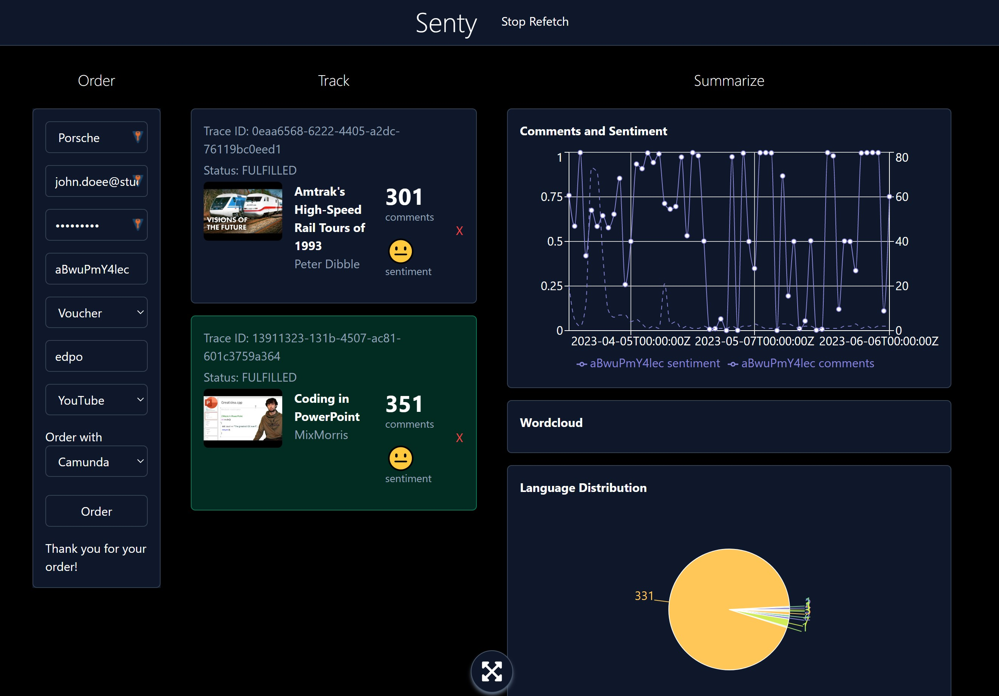

# Senty: Real-time Social Media Market Intelligence


<br />

Welcome to _Senty_, a real-time social media market intelligence platform designed and developed as part of the _Event-driven and Process-oriented Architectures (SS23)_ course at the University of St. Gallen. The brainchild of Johannes Wenz, Luka Bekavac, and Philipp John, Senty allows companies and creators to analyze comment responses from their YouTube videos at scale.

<br /><hr /><br />

## Table of Contents

1. [Introduction](#introduction)
2. [How to Run](#how-to-run)

   2.1 [API keys](#api-keys)

   2.2 [Docker](#docker)

   2.3 [Backend Services](#backend-services)

   2.4 [Frontend](#frontend)

3. [Services and REST Endpoints](#services-and-rest-endpoints)

   3.1 [Services](#services)

   3.1 [Used Ports](#used-ports)

   3.2 [REST Endpoints](#rest-endpoints)

   3.3 [Postman](#postman)

4. [Use Cases](#use-cases)
5. [Feature outlook](#feature-outlook)

<br /><hr /><br />

## Introduction

Senty is designed to enable users to conduct extensive analysis of YouTube video comment responses. Users can register with our service, paste links to the YouTube videos they want to analyze, and let our backend handle the rest. Leveraging the YouTube API, Kafka, and Camunda, our platform streamlines the process from user registration to payment orchestration and data streaming. With our custom topology and machine learning classification services for language detection and sentiment analysis, users receive a comprehensive overview of their audience's engagement and sentiments.




<br /><hr /><br />

## How to Run

The process of setting up and running Senty is straightforward and user-friendly.

Also please watch the [short demo video](https://www.canva.com/design/DAFlEnci8iU/HA6DIu9sjZEk-aitNtzBYg/watch?utm_content=DAFlEnci8iU&utm_campaign=designshare&utm_medium=link&utm_source=publishsharelink).

### API keys

To begin, add the YouTube API (provided in the assignment submission pdf) as environment variables to the `ScraperApplication` and `EmailNotifierApplication` configurations in IntelliJ respectively (as `API-KEY=...` in both cases).
If you run all in docker (recommended) you might have to update the API-KEY field in the `docker-compose-everything.yml` file only.
### Docker

Next, fire up the docker container from `/docker` with the command: `docker-compose -f docker-compose-everything.yml up --build`
The kafka container might fail on startup because zookeeper is not read yet. Just start it again, and potential other containers that fail because kafka is offline

*Warning*: This will take very long (depending on internet 20 mins because 17 containers), and eat around 70 GB of your disk space.
Plus your RAM will be used to 100% if you have 16 GB. Don't run it with less. 32 GB would be ideal.

After all containers are up and running, open the monitor service at http://localhost:8095/ and connect the socket to see the events in real time.


## Services and REST Endpoints

Prior to exploring specific use cases, familiarize yourself with our services and REST endpoints.

### Relevant Core Services

- `ProjectManagerCamundaApplication`: The heart of Senty. Is the Orchestrating Service which sends Commands and Tokens. Most of the other services report back to it. The service includes the Project Manager workflow.
- `CheckoutApplication`: Allows users to place orders (via frontend) and listens on all relevant events concerning the order status and updates placed orders in its database respectively, so users can query the order status.
- `RegistrationApplication`: Handles user registration requests. Includes the registration workflow and also the authentication workflow used for placing an Order.
- `EmailNotifierApplication`: Notifies users with various emails regarding their accounts, payments, milestones, and other events.
- `ScraperApplication`: Fetches YouTube video meta data and comments based on the URL or videoId of the video.
- `PaymentApplication`: Bills the customer for bought tokens or other services such as receiving “payment” via a voucher
- `CommentAnalysisApplication`: So far only a rudimentary service that counts comments and emits and event once a milestone of “n” comments is reached. (deprecated)
- `CommentProcessor`: Kafka Streams application that processes comments and classifies them using our custom sentiment and language classifiers.

### Used Ports

#### Camunda Side:

- `ProjectManagerCamundaApplication`: 8093
- `CheckoutApplication`: 8091
- `EmailNotifierApplication`: 8099
- `RegistrationApplication`: 8096
- `PaymentApplication`: 8100
- `ScraperApplication`: 7001

#### Old deprecated services used for earlier assignments:

- `CommentAnalysisApplication`: 8082
- `OrderApplication`: 8092

#### Kafka Streams:

- `CommentsProcessor`: 7002
- `ScraperApplication`: 7001

#### Docker

- `Frontend`: 3000
- `Kafka`: 9092 (29092 on localhost)
- `Zookeeper`: 32181
- `MongoDB`: 27017
- `DbAdmin`: 8089
- `Monitor`: 8095
- `Libretranslate`: 5002
- `sentiment-classifier`: 5000
- `language-classifier`: 2000

### REST Endpoints

- `ProjectManagerCamundaApplication`: http://localhost:8093/camunda/app/welcome/default/#!/login (user and password: _demo_)
- `CheckoutApplication`: http://localhost:8091/shop.html (deprecated)
- `OrderApplication`: http://localhost:8092/orders (deprecated)
- `RegistrationApplication`: http://localhost:8096
- `ScraperApplication`: http://localhost:8094
- `CommentProcessor`: http://localhost:7002
- `Frontend`: http://localhost:3000

For more details about the available endpoints, please refer to the next section. [Postman](#postman)

### Postman

Our Postman collection is stored in `/postman`. We suggest importing this collection into Postman for the easiest interaction with our application apart from our frontend.
https://learning.postman.com/docs/getting-started/importing-and-exporting-data/#importing-postman-data
<br /><hr /><br />

## Use Cases

Our use cases are organized into two parts. Part I highlights our capabilities in developing an event-driven and process-oriented architecture using Kafka and Camunda. Part II focuses on Kafka Streams.

### Use Cases – Part I

The following use cases are scenarios for Part I of the course, focusing on demonstrating our capabilities to develop an event-driven and process-oriented architecture using Kafka and Camunda.

#### Use Case 1: Happy Path

<u>Goal</u>: Register and validate a user who can then place an order to monitor a YouTube video and receive comment milestone email updates.

1. Register user with real email and approved company (please use "HSG" or
   "Porsche") by
   posting to
   http://localhost:8096/registration with the following JSON body:
   Find this in Postman under Camunda/Register New Customer

```
{
  "company": "HSG",
  "firstName": "John",
  "lastName": "Doe",
  "email": "your.actual@email.com",
  "password": "mypassword"
}
```

You should receive a 200 with a response similar to: `{"status":"completed", 
"traceId": "d4a1a0f6-8f01-4c03-8a0c-5229aa8654f7"}`.

In the `registration` service on Camunda
(http://localhost:8096/camunda/app/welcome/default/#!/login ; log in with username and password: `demo`), we can now see a new token that waits for email verification. Because the company is on a list of approved companies, the token waits at the merge
gate for the email verification.

2. Verify your email by clicking on the link you should receive in your
   email inbox (or spam folder most likely). Alternatively, you can also check the logs of
   the `EmailNotifierApplication` and click the link that is printed in the
   logs. The log looks something like this: `Sending Mail: Please verify at http://localhost:8096/verify?email=philipp.john@student.unisg.ch&traceId=59f8b15d-03ad-11ee-8afa-acde48001122`

Currently, only Amine's E-Mail (amine.abbad-andaloussi@unisg.ch) is registered
with our MailGun account and
would receive an actual E-Mail, so
should anyone else test the app, please click the log in the
`EmailNotifierApplication`.

The traceid here is the id of the process instance in Camunda. You can find it in the Camunda Cockpit. Once clicked, we update the user record in our database.

In Camunda, we can now see that the token went through.

3. Place order with real YouTube Video ID via our frontend. You can find the Video ID by clicking on the "Share" button and copying the part after the last `"/"`:


Alternatively, post an order via Postman (Camunda/New Order) to `http://localhost:8091/api/cart/order`. The details of your order should be specified in the request body:

```
{
    "companyName": "hsg",
    "customerId": "0001",
    "videoId": "r0cM20WPyqI",
    "tokens": "100",
    "voucher": "edpo",
    "platform": "YouTube"
}
```

4. Wait a while for the processing to finish. You can check if it actually works in the logs of the comment-processor
5. Make a new comment and wait ~30 seconds and your comment will appear in the last 5 comment list.

5. Since we connected Part I and Part II of EDPO, the frontend will also display all analytics features we have implemented as part of our Kafka Stream.

<hr />

#### Use Case 2: Registration failed

Goal: Demonstrate that a failed registration results in a customer being deleted from our database, and that the user cannot place an order.

1. Register user with real email and DISPROVED company by posting to http://localhost:8096/registration with the following JSON body:

```
{
  "company": "BMW",
  "firstName": "John",
  "lastName": "Doe",
  "email": "your email",
  "password": "mypassword"
}
```

In Camunda, we can now see a Human Task was created. If the Human Task does NOT approve the registration; this sets `approved` variable to `false`. The `approvalOutcomeAdapter` sets `humanApproved` to `false`.

The token then waits for email verification. If the email gets verified, by clicking on the authorization link, `mailVerified` is set to `true`. If email does not get verified within 48h `mailVerified` stays `false`.

The token now merges at the gateway, and `customer verified?` gate checks if `mailVerified == true` and `humanApproved_ == true`.

http://localhost:8096/camunda/app/tasklist/default/#/

Since `humanApproved == false`, the registration service now triggers a `cancel registration` compensation event. This deletes the unregistered customer from our database.

Leave Approve empty to disprove the registration.


<hr />


#### Use Case 3: Invalid YouTube URL

1. Use a registered customer E-Mail (produced in the Use Case 1: Happy Path) to place an order via our simple checkout frontend at http://localhost:3000 (or Postman Camunda/New Order). Only this time, provide an INVALID YouTube URL, for example: "invalidVideoId".

2. In the `monitor` service, we can now see that an event `OrderVerifiedEvent` has been triggered, if the data body doesn't contain information about the video, it is invalid and the Order gets rejected.


<hr />

#### Use Case 4: Payment failed

1. Follow the same steps as in Use Case 3 but with a VALID YouTube URL but a wrong voucher code. (One that is not "edpo")


<hr />


### Use Cases – Part II

The following use cases are based on the same scenario for part II of the course, focusing on demonstrating our capabilities to develop an event-driven and process-oriented architecture using Kafka Streams.

Goal of both scenarios: Analyze a YouTube video and display a number of analytics features:

- Number of comments fetched
- Average sentiment of all comments
- Sentiment over time
- Comments over time
- Top 5 latest comments translated to English
- Wordcloud of the top 5 latest comments

#### Use Case 1: Analyze YouTube video and view analytics with Frontend

1. Head to http://localhost:3000 and place a new order for any YouTube video you would like (preferrably tested first with a video that only has a small amount of comments, e.g., < 100, to see if everything works as expected):

2. Sit back, relax, and see how the analytics features are being displayed. For ca. 100 comments, our laptops take about 1-2 minutes to display the results, depending on the language of the comments.

#### Use Case 2: Analyze YouTube video and view analytics with Postman

1. Place a new order via Postman as seen in (Camunda/New Order)

2. After the order has been processed, proceed to got to the (Stream/*) folder in Postman and try out the requests replacing the videoIds with the videoId of the video you ordered.


## Feature Outlook

If the payment fails actually no information why it failed is propagated to the order status. We planned to implement this but due to time constraints we didn't
But we would add a field to the Order status containing that message and display it in the frontend if we had time.

We planned this system to be able to be extended by any scraper and also multiple instances of the same scraper for high availablity 
and also performance. For that reason we have implemented a basic version of a findscraper technique that should use an aggregator to find the best scraper
for the job. (Just like tapas in ASSE). Due to time constraints we didn't implement this and stayed with the youtube scraper, hence the findscraper bpmn looks a bit
weird.
