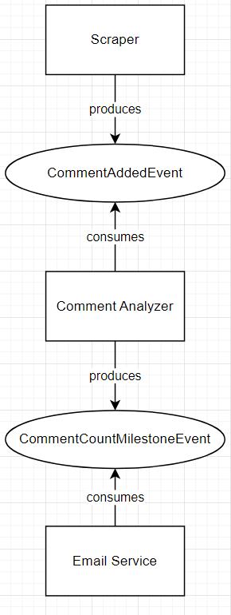

# HSG-EDPO-SS23 / Exercise 1 and 2

|         	|                         	|
|---------	|-------------------------	|
| Group   	| 2                       	|
| Members 	| Johannes, Luka, Philipp 	|
| Date    	| March 7, 2023           	|

 

# Exercise 1

## Part 2

### 2.1) The impact of load and batch size on processing latency:

Here we wanted to push the programm a little bit to its limit regarding the amount of data it can receive and how it effects the processing latency

### 2.1.1)
**Set-up 1**: We started up the clicksProducer and the ConsumerForClickEventsOnly1. We also modified the ClicksProducer to send clicks in an intervall of 50-500ms instead of 500-5000ms

**Test 1**: We wanted to check if all Events can still be received and with what delay

**Result 1**: The Consumer is still able to receive all events. There is a processing latency of about 5 events before displaying the event 

### 2.1.2)

**Set-up 2**: We started up the clicksProducer and the ConsumerForClickEventsOnly1. We also modified the ClicksProducer to send clicks in an intervall of 5-50ms instead of 500-5000ms

**Test 2**: We wanted to check if all Events can still be received and with what delay

**Result 2**: The Consumer is still able to receive all events. There is a processing latency of about 5 events before displaying the event. This makes us believe that maybe there is no delay at all, and the Java consol is just too slow to display everything

### 2.1.3)

**Set-up 3**: We started up the clicksProducer and the ConsumerForClickEventsOnly1. We also modified the ClicksProducer to send clicks in an intervall of 1-5ms instead of 500-5000ms

**Test 3**: We wanted to check if all Events can still be received and with what delay

**Result 3**: The Consumer is still able to receive all events. There is a processing latency of about 5 events before displaying the event. This makes us believe that maybe there is no delay at all, and the Java consol is just too slow to display everything

---

### 2.2) The outage of Zookeeper:

Zookeeper is a top-level software that acts as a centralized service and is used to maintain naming and configuration data and to provide flexible and robust synchronization within distributed systems. Zookeeper keeps track of status of the Kafka cluster nodes and it also keeps track of Kafka topics, partitions etc.
Zookeeper it self is allowing multiple clients to perform simultaneous reads and writes and acts as a shared configuration service within the system. The Zookeeper atomic broadcast (ZAB) protocol i s the brains of the whole system, making it possible for Zookeeper to act as an atomic broadcast system and issue orderly updates.

Different experiments are conducted to see how Zookeper is synchronzing Kafka topics and partitions

### 2.2.1)

**Set-up 1**: running both Producers ClicksProducers and EyetrackersProducer and the ConsumerForAllEvents.
Test1: Stopping Zookeeper via Docker in the middle of receiving Events

**Result 1**: 
Nothing happened in the process of receiving Events. The Producers are still creating data and the Cosumer is still getting the Data streamed.

**Explanation 1**: Since no rebalancing or change of Partitions/topics happened, the outage of Zookeeper should have had no influence on the Producers and Consumer.

### 2.2.2)

**Set-up 2**: running EyetrackersProducer and ConsumerForGazeEventsForEyeTrackerParitionsRebalancing1 + ConsumerForGazeEventsForEyeTrackerParitionsRebalancing2

**Test 2**: Stopping Zookeeper via Docker in the middle of receiving Events and the shutting down one of the  ConsumerForGazeEventsForEyeTrackerParitionsRebalancing to see if the rebalancing can still take place and if the running one will receive the Events from both Partitions again

**Result 2**: Rebalancing is still happening after some time. It is not dependent on Zookeeper as it seems.

**Explanation 2**: It is interesting to see that the rebalancing is still able to happen. We would have thought that the change of partitions and consumers would simply crash without Zookeeper

### 2.2.3)

**Set-Up 3**: Starting up ClicksProducer and ConsumerForClickEventsOnly1 + ConsumerForClickEventsOnly2
We should remember that the topic “click events” has 1 partition only and so this partition can be read by only one consumer within a consumer group.

**Test 3**: Stopping Zookeeper via Docker in the middle of receiving Events and the shutting down the non-idle ConsumerForGazeEventsForEyeTrackerParitionsRebalancing to see if the rebalancing can still take place

**Result 3**: 
Rebalancing is still happening after some time. It is not dependent on Zookeeper as it seems.

**Explanation 3**: It is interesting to see that the rebalancing is still able to happen. We would have thought that the change of Consumers would simply crash without Zookeeper.

---

### 2.3) The risk of data loss due to offset misconfigurations:

### 2.3.1)

Messages can get lost when the offset is misconfigured. We tested it with different Custom offsets and how it impacts the system		

**Set-up**: Started the ClicksProducer and adjusted the offSetToReadFrom variable in the class ConsumerCustomOffset

**Test**: tested the Consumer with different offsets like 50,100, -10

**Result**: The Consumers only started to Consum the messages after the certain offset was reached. It was interesting to see that a negative offset will throw a “java.lang.IllegalArgumentException: seek offset must not be a negative number” exception

 

# Exercise 2

## Part 2)

### GitHub
[https://github.com/Crousus/senty-kafka](https://github.com/Crousus/senty-kafka)

For the first implementation, we decided to keep the system simple. We made a scraper that mocks comment post events of 8 youtube videos of 2 youtube channels by reading them from `data/comments_filtered_merged_sorted_timed.json` (previous iterations of our data source, pre-cleaning, are also in this folder). We added an analyzer that currently just counts the ammount of postet comments and produces an Event once certain milestones are reached. The mail service picks this up and sends an email to a currently hard coded recepient. The currently relevant services in the repository are:
- scraper
- comment-analyzer
- email-notifier

### Architecture and message flow diagram:

### Contributions:
- Exercise 1: Luka
- Exercise 2: Johannes, Philipp

### 

