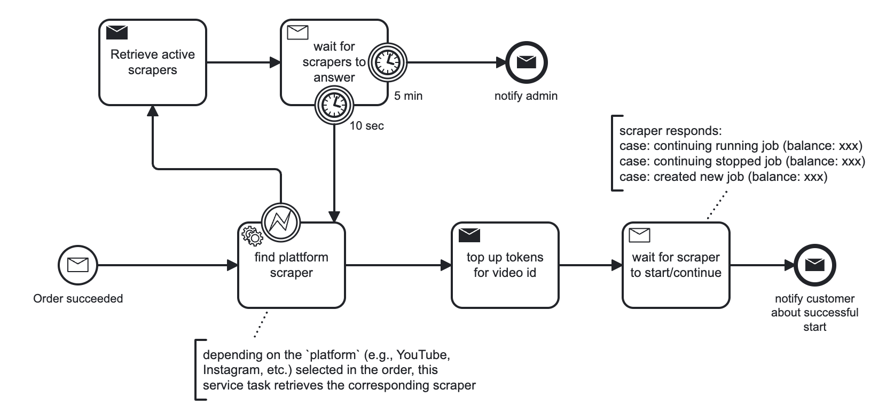
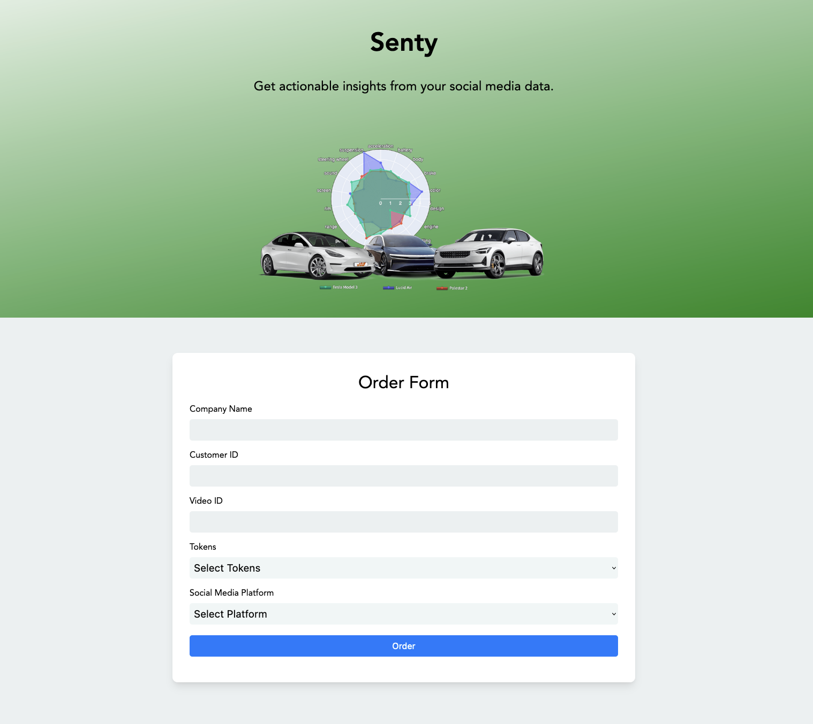
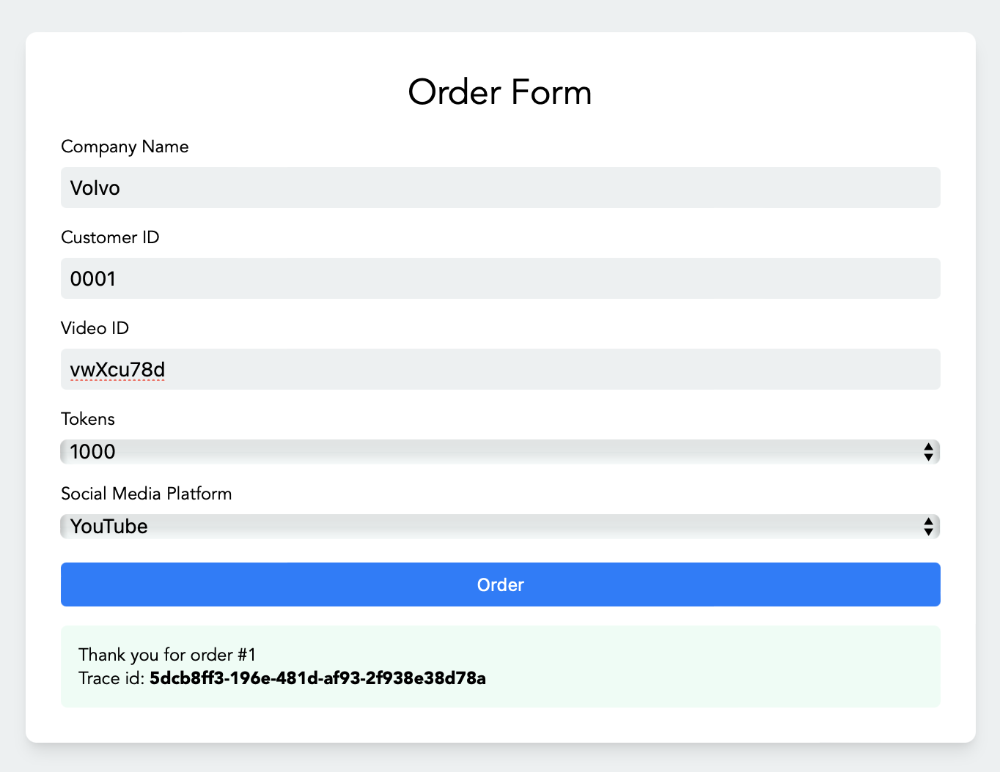
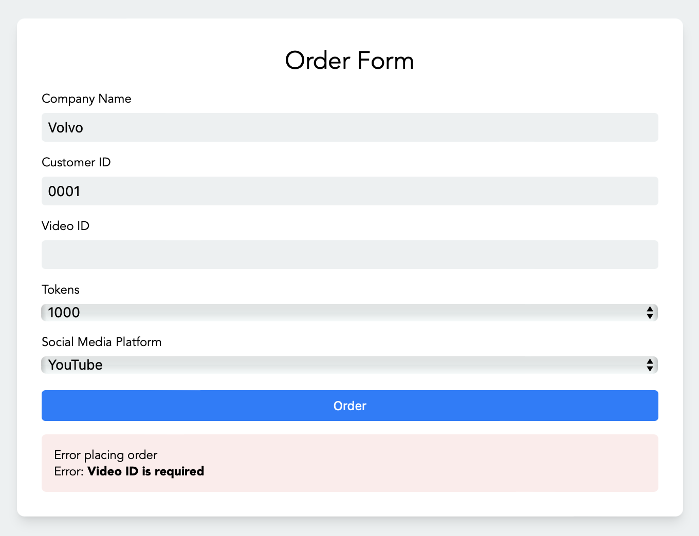
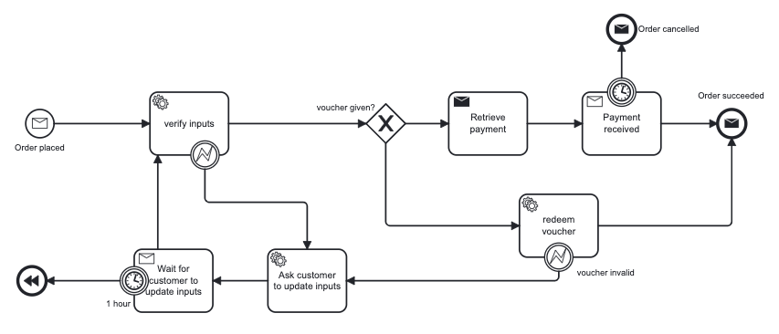

# HSG-EDPO-SS23 / Exercise 3 and 4

|         	| 	                         |
|---------	|---------------------------|
| Group   	| 2                       	 |
| Members 	| Johannes, Luka, Philipp 	 |
| Date    	| March 21, 2023           	 |

 

## Exercise 3

As elaborated in `adr/0002`, the decision has been made to use Camunda for process orchestration and Kafka for messaging, utilizing Kafka topics for exchanging messages and ensuring decoupling between services, with the consequence of increased scalability and efficiency but requiring more careful integration and potential increased complexity.

The `project-manager-camunda` (prev. `project-manager`), implements this decision and orchestrates the following workflow:

To accomplish the correlation between Kafka and Camunda, the `project-manager-camunda` uses a `MessageListener` that correlates a Kafka message to a Camunda process instance using the traceId provided in the Kafka message. 

Moreover, as suggested for Task 2, we implemented a simple HTML user interface to start the order process in our `checkout` service:

The form has some user support to display success and error messages:

 

## Exercise 4

We have extended our project to realize the following flow:

`checkout` --> `order` (see BPMN below) --> `project-manager-camunda` (see BMPN above) --> `scraper` --> `comment-analysis`

`order` BPMN:

Currently, mostly the "happy path" has been covered, and we plan to add a payment service similar to the flowing retail example. Moreover, we will still have to improve the naming and refactor our project a bit.

As we further explored the implementation of our system, we recognized the importance of applying the concepts of commands and events as learned in the lecture. Although we are still in the process of implementing these concepts, we have considered their application to our system design.

To optimize the sequence of crucial actions and ensure that they are executed reliably, we have chosen to implement payment retrieval and topUp messages as commands. The payment service and the selected scraper service are solely responsible for their actions, respectively. We have also incorporated an answer verification step in the project manager's BPMN to ensure that the designated scraper takes on the required job.

While determining the optimal approach for the order succeeded/placed event, we have implemented it as an event for the time being. Additionally, we have decided to implement the retrieve active scrapers step as an event to guarantee that all active scrapers respond to the "call" and indicate their availability.

 

## Contributions:
|          | Johannes | Luka | Philipp |
|----------|----------|------|---------|
| Backend  | ++       | +    | +       |
| Frontend | +        | +    | ++      |
| BPMN     | ++       | ++   | ++      |
| ADR      | ++       | +    | ++      |

