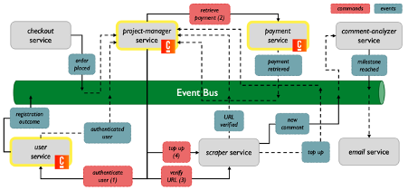

# ADR 0005: Updating Orchestration vs Choreography and Events vs Commands

## Status

Accepted

## Context

As we advanced our project setup, we need to reconsider how to handle communication between microservices, choosing between orchestration and choreography approaches. Additionally, we have to think about when to use events, and when to use commands.

## Decision

In our updated project, we will adopt a hybrid approach that leverages both orchestration and choreography, as well as events and commands:

Orchestration (via Camunda):
- `project-manager-camunda`: Retrieves events from other services and sends commands
- `payment`: Receives command and sends event
- `registration`: Retrieves command and sends event

Choreography:
- `scraper`: Retrieves commands and sends events
- `email-notifier`: Retrieves event
- `comment-analysis`: Retrieves event and sends event
- `checkout`: Sends event

The following diagram illustrates our Event Chain, which reflects the changes in terms of orchestration vs. choreography as well as events vs. commands:

## Consequences

By implementing a hybrid approach, we can take advantage of the strengths of both orchestration and choreography, as well as events vs commands:

- Decreased complexity and easier maintenance: Workflows become more visible and understandable, making it easier to identify and manage dependencies between services, leading to a more maintainable system.
- Improved scalability and flexibility: Choreography helps the system scale by enabling decentralized communication, while orchestration allows for better control and centralized coordination for certain critical services.
- Clearer communication patterns: The deliberate use of events and commands helps to establish clearer communication patterns between services. Events allow for reactive responses, enabling services to react to changes in the system without being explicitly commanded, promoting decoupling and flexibility. Commands, on the other hand, provide explicit instructions for services, ensuring that certain critical actions are executed as intended.
- Easier maintenance and evolution: The separation of concerns between orchestrated and choreographed services simplifies maintenance and allows for more agile updates or replacement of individual components.

However, this hybrid approach may introduce some challenges:

- Potential for decreased fault tolerance and performance: The project-manager-camunda service becomes more critical as a single point of failure due to its orchestrating role, potentially affecting the overall fault tolerance.
- Potential for inconsistent service interactions: Care must be taken to ensure that orchestrated and choreographed services interact smoothly and consistently, particularly when they are part of the same workflow or process.